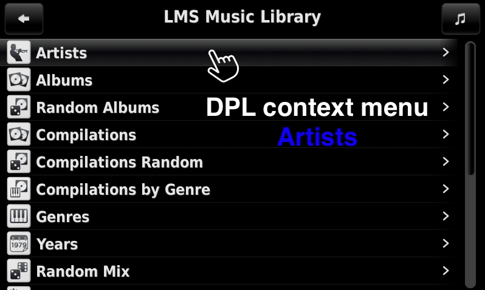
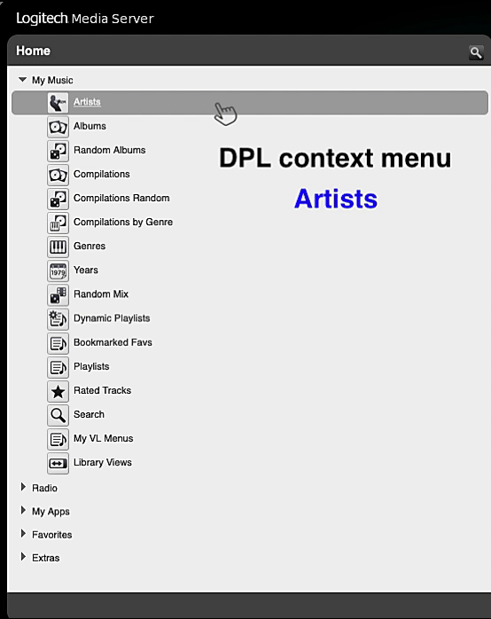
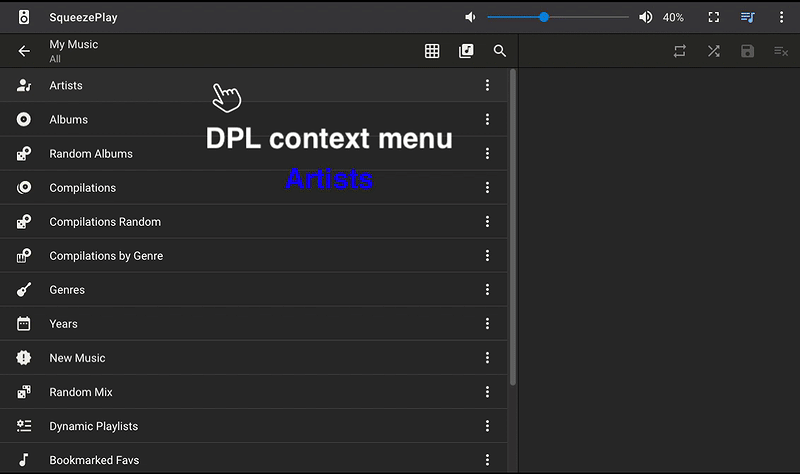

Dynamic Playlists 3
====

This plugin1 lets you play continuous music mixes based on selection criteria defined in so-called <i>dynamic playlists</i>. 
*Dynamic Playlists 3* will keep adding small batches of tracks in random order to your current playlist (complete albums can be added in album order). It comes with a collection of built-in, ready-to-use dynamic playlists to get you started. At some point you'll probably want to create a dynamic playlist that's tailored to your very specific needs because the <i>built-in</i> dynamic playlists cannot cover all possible use cases.  
Some preferences are not enabled by default. Please take a look at the preferences and their descriptions on the plugin's settings page.
  
[⬅️ **Back to the list of all plugins**](https://github.com/AF-1/)
  

## Requirements

- LMS version >= 7.**9**
- LMS database = **SQLite**
   

## Installation
⚠️ **Please read the [FAQ](https://github.com/AF-1/lms-dynamicplaylists#faq) *before* installing this plugin.** 

You should be able to install **Dynamic Playlists 3** from the LMS main repository (LMS plugin library): **LMS > Settings > Plugins**. 

If you want to test a new patch that hasn't made it into a release version yet or you need to install a previous version, you'll have to [install the plugin manually](https://github.com/AF-1/sobras/wiki/Manual-installation-of-LMS-plugins).

*Previously released* versions are available here for a very *limited* time after the release of a new version. The official LMS plugins page is updated about twice a day so it usually takes a couple of hours before new released versions are listed.
    

## Features:
* Use **your own custom dynamic playlist files/definitions directly in DPL** without intermediary plugins - you don't have to install other plugins to get dynamic playlists. See [FAQ](https://github.com/AF-1/lms-dynamicplaylists#faq).
* Comes with 190+ ready-to-use dynamic playlists (stand-alone + for context menus).
* **Multiple** selection of *genres*, *decades*, *years* and *static playlists*
* **Pre**select multiple *artists* or *albums* from their context menu at your leisure. DPL remembers your **pre**selection so that you can easily use it later with dynamic playlists that use **preselection**.
* Use LMS **virtual libraries**.
* Save dynamic playlists with (user input) parameters to LMS **favourites** (see [FAQ](https://github.com/AF-1/lms-dynamicplaylists#faq)).
* Create a *Don't Stop the Music* seed list and auto-start your DSTM mix.
* New playlist parameters (see [wiki](https://github.com/AF-1/lms-dynamicplaylists/wiki/DPL-playlist-format)).
* New preference options and UI changes.
* If you have installed the [**Alternative Play Count**](https://github.com/AF-1/lms-alternativeplaycount) plugin, you will see some additional dynamic playlists that use the data from this plugin.
* …
    

## Context Menus
While the Dynamic Playlists menu in the LMS home menu is easy to find, its **context menus** can easily be overlooked. You'll find the **Dynamic Playlists menus** in the *context menus* for **artists**, **albums**, **genres**, **years** (for years and decades) and **static playlists**. Some of them are presented below.
  

### Players with Jivlite UI (Touch, piCorePlayer, SqueezePlay, Radio)

 

### LMS Web UI - Default Skin

 

### Material Web UI

    

## Translation
The [**strings.txt**](https://github.com/AF-1/lms-dynamicplaylists/blob/main/DynamicPlaylists3/strings.txt) file contains all localizable strings. Once you're done **testing** the plugin with your translated strings just create a pull request on GitHub. 
* Please try not to use the [**single**](https://www.fileformat.info/info/unicode/char/27/index.htm) quote character (apostrophe) or the [**double**](https://www.fileformat.info/info/unicode/char/0022/index.htm) quote character (quotation mark) in your translated strings. They could cause problems. You can use the [*right single quotation mark*](https://www.fileformat.info/info/unicode/char/2019/index.htm) or the [*double quotation mark*](https://www.fileformat.info/info/unicode/char/201d/index.htm) instead. And if possible, avoid (special) characters that are used as [**metacharacters**](https://en.wikipedia.org/wiki/Metacharacter) in programming languages (Perl), regex or SQLite.
* It's probably not a bad idea to keep the translated strings roughly as long as the original ones. 
* Some of these strings are supposed to be used with different UIs: my tests usually cover the LMS *default* skin, *Material* skin, *piCorePlayer* (or any other jivelite player like *SqueezePlay*) and maybe some ip3k player like *Boom* if applicable.
* Please leave *(multiple) blank lines* (used to visually delineate different parts) as they are.
    

## FAQ

»<b>How do I create my own <i>custom</i> dynamic playlist?</b>«
 

Dynamic playlist definitions are basically plain text files with a "<b>.sql</b>" file extension that contain your playlist definition, i.e. a couple of <b>parameters</b> (<i>general</i> parameters like the playlist name, group or category and <i>user input</i> parameters) and the <b>SQLite statement</b> itself to fetch tracks from the LMS database.  
If you still have custom dynamic playlists in the unsupported SQLPlayList plugin, you should export them <b>as "Customized SQL"</b> files (file extension: <b>.sql</b>) and use them directly in DPL v3. This way you make sure that your custom dynamic playlists will continue to work when SQLPayList stops working or is no longer compatible with DPL3.  
First see if you can find a <i>built-in</i> dynamic playlist that suits your needs. You can edit dynamic playlists in any (plain text) editor, add new playlist parameters or create more complex sqlite definitions. This will give you a great deal of freedom in creating dynamic playlists tailored to your specific needs. 
And if you need help with your custom dynamic playlist, there's a dedicated  <a href="https://forums.slimdevices.com/showthread.php?115501-Dynamic-Playlists-3-get-help-with-your-custom-playlists"><b>LMS forum thread</b></a>. 
In any case <b>please read the <a href="https://github.com/AF-1/lms-dynamicplaylists/wiki/DPL-playlist-format">wiki</b></a> for more information on the dynamic playlist <b>format</b>.

 

»<b>I have a custom playlist definition (file). How do I add it to/ use it directly in DPLv3?</b>«
 

- If you already have a dynamic playlist definition <b>file</b> (file extension: <b>.sql</b>), you can skip the next 2 steps. 

- Open a plain text editor of your choice and copy&paste (or edit) your playlist definition (parameters and SQLite statement). 

- Save it as "nameofyourchoice.sql". The file extension <b>.sql</b> is important. 

- Now put this file in DPL's <i>folder for custom dynamic playlists</i> called <b>DPL-custom-lists</b>. Unless you've changed its location in DPL's settings you'll find this folder in your <i>LMS playlist folder</i>. 

- The new dynamic playlist should now be listed in DPL, either in the <i>Not classified</i> group or in other groups according to what the <code>-- PlaylistGroups</code> parameter in your playlist definition says.

 

»<b>What's <i>preselection</i>? How does it work?</b>« &nbsp;&nbsp;&nbsp;&nbsp;»<b>There's more than one DPL context menu item.</b>«
 

DPL has playlist parameters that allow you to select <b>multiple</b> genres, decades, years and static playlist. But even the smallest music libraries have a large number of <b>artists</b> and <b>albums</b> that would result in poorly browsable, far too long selection lists. The solution is to gather/select artists or albums <i>first</i> using the <b>preselection</b> context menu item and then start a dynamic playlist for preselected artists/albums. 
So for <b>artists</b> and <b>albums</b> DPL will show a <b>second <i>context</i> menu</b> that allows you to <b>preselect</b> this artist/album while browsing your music library. DPL will remember your (pre)selection <i>until the next LMS restart/rescan</i> 2. Once you've finished preselecting artists/albums, go to DPL's home menu and use this selection with any dynamic playlist that makes use of the <code>PlaylistPreselectedArtists</code> or <code>PlaylistPreselectedAlbums</code> playlist parameter. There are some built-in dynamic playlists to get you started (in the <i>Songs</i> group). And it's very easy to add these playlist parameters to your custom dynamic playlists. Read this <a href="https://github.com/AF-1/lms-dynamicplaylists/wiki/DPL-playlist-format#user-input-parameters"><b>wiki</b></a> section for more information.

 

»<b>How does DPL work with the <i>Don't Stop the Music</i> plugin?</b>« &nbsp;&nbsp;&nbsp;&nbsp;»<b>What does the icon with the infinity symbol do?</b>« &nbsp;&nbsp;&nbsp;&nbsp;»<b>What does “<i>Create DSTM seed list and play</i>“ mean?</b>«
 

The <i>Don't Stop the Music</i> (DSTM) plugin “will automatically add similar music to what you've been listening to ... once you've reached the end of your playlist“. DSTM takes a look at the existing tracks in your client's playlist (the <i>seed list</i>) to determine what kind of tracks to search for.  As long as <i>Dynamic Playlists 3</i> is <b>active</b>, i.e. playing a dynamic playlist, DSTM will <b>not</b> interfere and add tracks.  But now you can use <i>Dynamic Playlists 3</i> to create a DSTM seed list from any dynamic playlist and start a DSTM mix for you. There's a preference setting if you prefer to skip playback of all seed list tracks (but the last one).

 

»<b>How do I know whether DPL is still <i>active</i>?</b>« &nbsp;&nbsp;&nbsp;&nbsp;»<b>What causes DPL to no longer be active?</b>«
 

To find out whether <i>Dynamic Playlists 3</i> is still <b>active</b> just enter the DPL menu from the <i>Home/My Music</i> menu. If it's still active, it will display the active dynamic playlist at the top of the DPL menu. Some actions/events that stop DPL (= no longer active): clearing your client playlist, DPL no longer finds tracks for the active dynamic playlist, you told DPL to stop adding tracks...

 

»<b>I've added a dynamic playlist to my LMS favorites, but it no longer works.</b>« &nbsp;&nbsp;&nbsp;&nbsp;»<b>DPL shows a favorite icon with a <i>p</i> (default skin) or an orange tint (classic skin) next to my dynamic playlists. Why?</b>«
 

Before DPL v3.6+ you could only add <i>one-click</i> dynamic playlists to the LMS favorites menu, i.e. dynamic playlists that <b>don't</b> request user input. Now DPL3 allows you to add dynamic playlists with playlist parameter values (= values from user input) to LMS favorites - with some <b>limitations</b>: 

- This feature is experimental and is <b>limited to the LMS web UI</b> (<i>Default</i> and <i>Classic</i> skin), <b>players with jivelite UI</b> (<i>Touch</i>, <i>Radio</i>, <i>SqueezePlay</i>, <i>piCorePlayer</i>) and <b>Material</b> skin. 
- Saving dynamic playlists with user input values basically means you're saving a url with fixed playlist parameters as a one-click dynamic playlist. The value of <i>some</i> of these playlist parameters (LMS database IDs like artist/contributor IDs, album IDs, genre IDs, playlist IDs or virtual library IDs) might change after a (delete/wipe) rescan. Other parameters included in the saved URL (such as <i>list</i> parameters defined in the dynamic playlist definition, years, decades or max./min. rating values) won't be affected by a rescan. So please remember: <b>a (delete/wipe) rescan might invalidate some dynamic playlists favorites <i>with saved user input values</b></i>. You'll have to remove & <b>readd</b> them. Therefore I suggest you choose a good descriptive name so you'll remember what parameter values you chose (like "Alternative 80s rated").  

In short: you can <i>save</i> dynamic playlists that request user input as LMS favorites now. Once saved they should behave like normal favorites (one-click action). If favorites with certain parameters (esp. artist/album/genre/track/playlist IDs) stop working after a (wipe/delete) rescan, just remove and readd them.

 

»<b>The <i>Not classified</i> group in the DPL (home) menu has disappeared / doesn't show.</b>«
 

The <i>Not classified</i> group in the DPL (home) menu and on settings pages will only be displayed if DPL found dynamic playlists that belong in this group, i.e. if it's not empty.

 

»<b>This <i>built-in</i> dynamic playlist is missing a feature that I really want.</b>«
 

The collection of <b>built-in</b> dynamic playlists includes only a large but limited set of frequently used playlists that won't see regular additions or updates. It can also be used as a <i>starting point</i> for creating your <b>own custom</b> dynamic playlists whose very reason for existence is to help you create dynamic playlists tailored to your <i>specific</i> needs.

 

»<b>I don't want my dynamic playlist in the <i>Not classified</i> group. I want a custom group (name).</b>«
 

The <i>Not classified</i> group is a <i>catch-all group</i> for all dynamic playlist that are <b>not</b> assigned to any playlist <i>group</i>. You can <b>create your own custom playlist groups</b> by setting the <code>-- PlaylistGroups:</code> parameter in your dynamic playlist definition (see <a href="https://github.com/AF-1/lms-dynamicplaylists/wiki/DPL-playlist-format#general-parameters"><b>wiki</b></a>).

 

»<b>Does DPL handle online tracks?</b>«
 

<i>Dynamic Playlists 3</i> will process <b>online tracks</b> that have been <b>added to your LMS library as part of an album</b>. LMS does not import <b>single</b> online tracks or tracks of <i>online</i> <b>playlists</b> as <b>library</b> tracks and therefore they won't be processed by <i>Dynamic Playlists 3</i>.

 

»<b>Some dynamic playlist are not sorted in alphabetical order.</b>«
 

In general <i>dynamic playlists</i> will <b>always</b> be listed in this order: 1. built-in  2. custom/user-provided  3. provided by other plugins. Dynamic playlists in the last two groups should be listed in <i>alphabetical</i> order. <b>Built-in</b> dynamic playlists are listed in a 'content-based' order created by me. For example, I try to group dynamic playlists together that are about ratings, play count or genre/decade selection. If you don't like how I ordered the built-in dynamic playlists, don't forget that you can clone these playlists and even put them in a custom playlist group just by adding the corresponding parameter (see <a href="https://github.com/AF-1/lms-dynamicplaylists/wiki/DPL-playlist-format#general-parameters"><b>wiki</b></a>). Static (saved) playlists will always be ordered alphabetically.

 

»<b>Can I use CLI commands to control DPL?</b>«
 

Explained in the <a href="https://github.com/AF-1/lms-dynamicplaylists/wiki/CLI-commands">wiki</a>.

 

»<b>The <i>Home > Dynamic Playlists</i> menu doesn't show dynamic playlists for <i>context menus</i>. Why?</b>«
 

By default the <b>Home > Dynamic Playlists</b> menu will only show dynamic playlists that <i>don't</i> include the <code>-- PlaylistMenuListType:contextmenu</code> parameter. Here you won't find any dynamic playlists that can be called from an item's context menu. 
And <b>context menus</b> (= <i><b>M</b>ore</i> menu in the web UI or <i>click/touch-hold</i> on jivelite players) will <i>only show dynamic playlists for context menus</i>. So there may be some overlap but this separation greatly helps reduce clutter.

 

»<b>I want my dynamic playlist to use one of CustomSkip3's filter sets.</b>«
 

Just add the necessary <b>action/CLI playlist parameters</b> to the SQLite code of your custom dynamic playlist as described <a href="https://github.com/AF-1/lms-dynamicplaylists/wiki/DPL-playlist-format#general-parameters">here</a>. 
If you only need <b>one</b> filter set for <b>all</b> dynamic playlists, create a CustomSkip3 filter set that will <i>only</i> be active if DPL3 plays a dynamic playlist. See CustomSkip3 <a href="https://github.com/AF-1/lms-customskip/wiki#i-want-customskip-to-filter-only-dynamic-playlist-tracks">Wiki</a>.

 

»<b>Is DPL v<i>3</i> compatible with my old plugins?</b>«
 
<i>Dynamic Playlist 3</i> removes ties to unsupported plugins in a way that they shouldn't break <i>Dynamic Playlists 3</i> if those plugins ever stopped working properly. And <b>within these limits</b> DPL v<b>3</b> tries to maintain as much backwards compatibility as possible.  So <b>older plugins <i>might</i> work with DPL v3 but I won't guarantee that they do or will continue to do so.</b> And I won't spend time on making DPL v3 compatible with unsupported plugins</b>. <i>Somebody else</i> would have to maintain, test and update those plugins to keep them fully compatible with newer versions of DPL v<b>3</b> and provide support for them. 

- <b>CustomSkip</b>: DPL v<b>3</b> works with <a href="https://github.com/AF-1/lms-customskip"><b>CustomSkip 3</b></a>. Please read the CustomSkip <a href="https://github.com/AF-1/lms-customskip#faq">FAQ</a> first <b>before</b> installing it. 

- <b>SQLPlayList</b>: The main features (creating simple dynamic playlists and making them available to DPL3) should work. Compatibility not guaranteed, not supported by me.  
<b>You don't have to use SQLPayList to <i>create</i> dynamic playlists or make them <i>available</i> to DPL3</b>. 
For most dynamic playlists in SQLPlayList you can probably find a similar built-in dynamic playlist in DPL3. Or, with little effort, you can create a <i>custom</i> dynamic playlist using a built-in dynamic playlist as a template. If you want to uninstall SQLPlayList and migrate your old dynamic playlists from SQLPlayList to DPL3, you only have to export them and put the exported files in the DPL3 folder for custom dynamic playlists (see details in the first two FAQs about <i>custom dynamic playlists</i>).  
If you still want to use SQLPlayList to create custom dynamic playlists, please note this: while SQLPlayList can still assist you in <i>creating</i> simple dynamic playlists, it doesn't support any of the new parameters (multiple genres, multiple decades...) and features (artist/album preselection...) introduced with DPL3.  
Since DPL3 uses a different plugin name, the reference to the old DPL version 2 is broken. So SQLPlayList 2.6.27 displays an error at the bottom of its main page where it used to display the currently playing dynamic playlist. Just ignore this error.

- <b>TrackStat</b> / <b>CustomScan</b>: could work, not tested. Compatibility not guaranteed, not supported by me. For most dynamic playlists in TrackStat you can probably find a similar built-in dynamic playlist in DPL3. 

- <b>MultiLibrary</b>: might work, not tested. Compatibility not guaranteed, not supported by me. I recommend migrating from the <i>MultiLibrary</i> plugin to native LMS <b>virtual libraries</b> so you can use DPL v3 <i>playlist parameters</i> for virtual libraries (ID, name and user input selection). You can easily create new virtual libraries using saved <b>advanced search</b>es. Or, if you're a little familiar with SQLite, there's the [<b>SQLite Virtual Libraries</b>](https://github.com/AF-1/lms-sqlitevirtuallibraries) plugin that lets you use SQLite statements to create virtual libraries.

    

## Bug reports

If you want to **report a bug**, please **provide relevant server log entries and the version numbers of this plugin, LMS, Perl, and your OS**. You'll find them on the *LMS* > *Settings* > *Plugins* and the *LMS* > *Settings* > *Information* pages.

Please post bug reports *only* [**here**](https://forums.slimdevices.com/showthread.php?115073-Announce-Dynamic-Playlists-3-(mod)).
   

1 Based on Erland's <i>DynamicPlayList</i> plugin. 
2 You can't save your preselection permanently, it's really more of a <b>short</b>-term thing. If you have a fixed selection of artists or albums that you want to listen to frequently, you can "hard-code" them into <b>your own custom</b> dynamic playlist.
